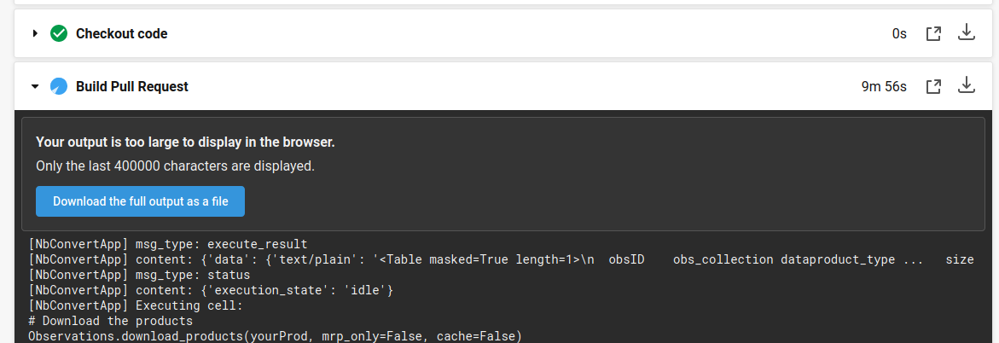

Getting Started
---------------

`nbcollection-ci` is designed to be installed locally with python-pip or git. It provides a set of commands that will
install and assist in managing CI/CD Pipelines. Only CirclCI is supported, however it's still straight forward to add
nbcollection-ci to Github Actions, Jenkins or another CI/CD solution.

This document covers what nbcollection-ci expects to see in a repository and associated pull request. Let's start with
an example project called `nbcollection-demo`. nbcollection-demo has all the moving parts of `nbcollection-ci pull-request` implemented.
https://github.com/jbcurtin/nbcollection-demo/pull/2. It concludes with building a website by merging artifacts from CircleCI, which can
than be commited into a Github Pages complient repository on Github.

How to install
==============

.. code-block:: bash

    $ pip install git+https://github.com/jbcurtin/nbcollection.git

How to manage a Pull Request
============================

Pull Request 2 has all the elements you'd expect to see when running a build. The PR has `nbcollection-ci` installed, 
nbcollection-ci will be aware that it has been trigger inside a Pull Request and skip build processes and only fully build
the "Pull Request" build in the CI Panel

.. image:: images/circleci-builds-in-github.png
    :width: 650
    :alt: CircleCI Builds found in a Github Pull Request

Go ahead and open the "Details" link for "Pull Request" build in another tab to inspect the CircleCI Build logs for
this specific pull request.

With these Build Logs, maintainers will be able to determine most if not all reasons for a failed build. With this short
introduction to tools available. I'd like to introduce some of the technology implemented in `nbcollection-ci` that you,
the maintainer might come across while using this tool.

`nbcollection-ci` is built following the methodology of Fail-Fast (https://en.wikipedia.org/wiki/Fail-fast) and be as
verbose in logging as possible. The way this has been implemented in the build process is by creating specific build
errors relative to context the error may exist within. For example, if a `requirements.txt` file is missing. `nbcollection-ci`
will raise an error indicating that the file is missing.

This translates will into how Jupyter Notebooks are built too. The errors shown within the CircleCI Build Logs will
indicate the exact stack trace that caused the error, however the exact cell will still need to be correctly interpreted 
by the maintainer. This is a limitation of Jupyter Notebooks and the way it counts/tallies Jupyter Cells/Kernels.

`nbcollection-ci` introduces a few new concepts. Collections, Categories, and Notebooks. All contexts used to generate and
invoke an isolated build environment.

Collections are folders found in the root level of a repository. In the example of `spacetelescope/dat_pyinthesky`_. Collections are,

.. _spacetelescope/dat_pyinthesky: https://github.com/spacetelescope/dat_pyinthesky

* concept_APIs
* hst_nb_viz
* jdat_notebooks
* jupyter_platform
* jwst_nb_viz
* planning_outlines

The attributes that elevate these folders into a collection are

* The collection is a folder or directory
* The collection exists at the root of the repository
* The collection contains one or more categories

Categories are a little more complex. Categories are responsible for setting up and running build environments for notebooks.
Looking into `jdat_notebooks`, some categories are

* asdf_example
* example_notebook

The attributes that elevate these folders into a category are

* The category is a folder or directory within a collection
* The category contains one or more notebooks and a `requirements.txt` file

Categories are somewhat special, they don't need to be directly inside a collection. Instead, categories can be
semantically present in a deeply nested folder structure. The folder names between the collection and category are
turned into namespaces by `nbcollection-ci`. These namespaces can than be used as semantic dividers when merging
artifacts and generating a website

How to manage Main Branch
=========================

Being the infrastructure engineer, your task list is endless and your coffee is bottomless. You're grey matter is a
finite resource and must be protected so that when you turn of your screen or walk away from your desk. You'll have enough
brain functionality to put the kids to bed or stand in the street yelling at your neighbors kids for taking over part of
your lawn while they play kick ball in the cul de sac.

To preserve your time, `nbcollection-ci` implementes a series of commands to assist in managing and perserving time for
all parties interested in using the framework. Since we've already talked about how to manage a pull request, lets cover
what to do on the main branch after the pull request has been merged.

We've recently closed `https://github.com/jbcurtin/nbcollection-demo/pull/1` and need to update the CircleCI `config.yml` file
to run concurrent builds. `nbcollection-ci` expects this kind of workflow and has created a set of commands to make this process
as seemless as possible. We'll run a command to render a new `config.yml` file to add the a category in `jdat_notebooks` collection, 
called background_estimation_imaging notebooks.

.. code-block:: bash

    $ git clone git@github.com:jbcurtin/nbcollection-demo.git $HOME/nbcollection-demo
    $ cd $HOME/nbcollection-demo
    $ git rename remote origin jbcurtin
    $ nbcollection-ci generate-ci-env --ci-environment circle-ci -p $PWD
    $ git commit -m 'Updated CircleCI Config with latest collections and categories found in main branch' -a
    $ git push jbcurtin main

`nbcollection-ci generate-ci-env` has destroyed and created the `.circleci/config.yml` for all collections and categories found in
`$HOME/nbcollection-demo`. With these changes pushed to Github and the new `config.yml` file will invoke a full run with all build jobs
running in a concurrent manor.

How to generate a website from Main Branch builds
=================================================

Mananging and building websites utilizes CircleCI API to extract the latest bulit artifacts from concurrent builds. Its
still possible to go in and alter the way the HTML files are generated in each of the builds, eventually making it easier to
generate a themed website and not simply the blank static website we can generate right now. Something left to be done in Q2.

With a completed Pull Request, we'll take the HTML artifacts generated and available in CircleCI. Download them and merge
them into a website using `nbcollection-ci merge-artifacts`. 

.. code-block:: bash

    $ nbcollection-ci merge-artifacts -p /tmp/merge-artifacts -r nbcollection-demo -o jbcurtin

With the artifacts created in `/tmp/merge-artifacts`, lets copy the files into `nbcollection-demo` and push them to Github Pages.

.. code-block:: bash

    $ git checkout -b gh-pages
    $ rm -rf ./*
    $ cp -r /tmp/merge-artifacts/site .
    $ git commit -m 'Uploading nbcollection-demo Website' -a
    $ git push jbcurtin gh-pages

Give Github Pages some time to update, then navigate to https://github.io/jbcurtin/nbcollection-demo

