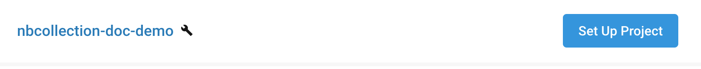
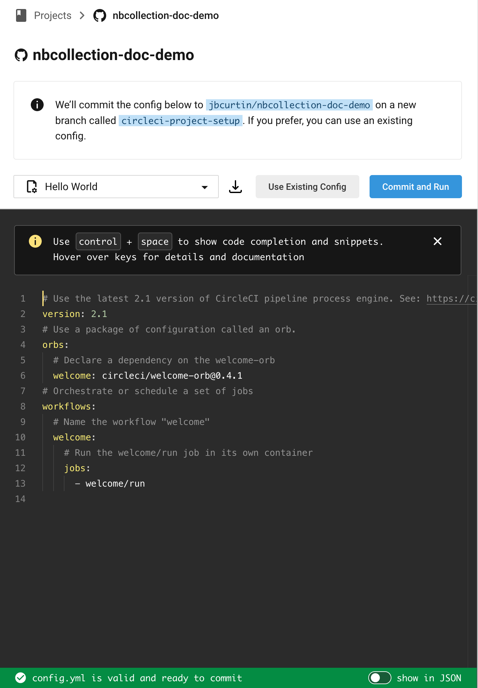
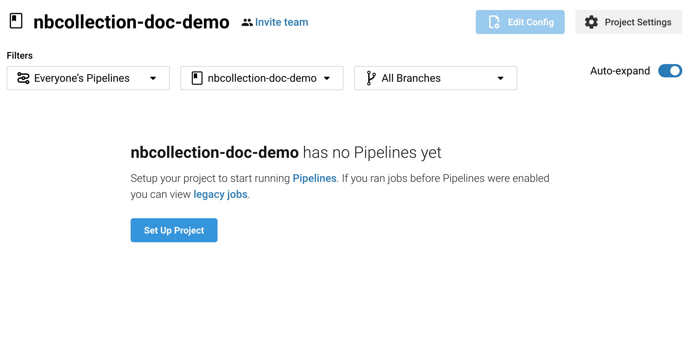
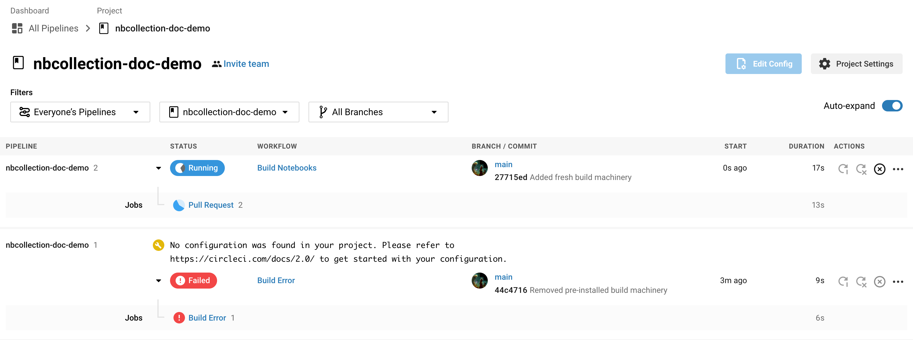

Installing Build Machinery
--------------------------

This document will cover how to install `nbcollection-ci` Build Machinery into a new repository intended to peer
 review Jupyter Notebooks. Instead of creating a new repository with notebooks, we'll clone
 `spacetelescope/jdat_notebook` into another repository and configure it to be ran using CircleCI.

Creating Github Repository, Setting up CircleCI, Creating Content
=================================================================

Creating a Github Repository
++++++++++++++++++++++++++++

If you're new to github, I recommend following the official documentation on how to create a repository

* https://docs.github.com/en/github/getting-started-with-github/create-a-repo

Inserting content into the newly created Github Repository
++++++++++++++++++++++++++++++++++++++++++++++++++++++++++

I've created https://github.com/jbcurtin/nbcollection-doc-demo in my Github Account. I'll clone that repository,
 add a new GitRemote pointing to git@github.com:spacetelescope/jdat_notebooks.git and copy the content into
 nbcollection-doc-demo.

Near the end, we'll remove build machinery previously installed. This is meant to provide us with a consistent user
 experiance between this tutorial and your user-flow. If you're feeling adventurous, feel welcome to skip that step.

.. code-block:: bash

    $ git clone https://github.com/jbcurtin/nbcollection-doc-demo.git
    $ cd nbcollection-doc-demo
    $ git checkout -b main
    $ git remote rename origin jbcurtin
    $ git add remote spacetelescope git@github.com:spacetelescope/jdat_notebooks.git
    $ git fetch --all
    $ git reset spacetelescope/main --hard
    $ rm -rf .circleci
    $ git commit -m 'Removed pre-installed build machinery' -a
    $ git push jbcurtin main

Enabling CircleCI
+++++++++++++++++

Navigate to CircleCI and login. ( https://circleci.com/signup/ )

With an account created and ready, navigate to projects in the dashboard and find `nbcollection-doc-demo`.

**+Click: Set Up Project**

**+Click: Use Existing Config**

At this point, the project is setup and we can stop following UI flow. Instead navigate back to projects and select 
nbcollection-doc-demo.

Installing Build Machinery
++++++++++++++++++++++++++

Turning our attention back to a terminal, lets install nbcollection & nbcollection-ci and generate fresh Build Machinery
for our /tmp/nbcollection-doc-demo repository.

.. code-block:: bash

    $ pip install git+https://github.com/jbcurtin/nbcollection.git
    $ pip install GitPython requests toml PyYaml
    $ nbcollection-ci generate-ci-env --collection-names notebooks --project-path /tmp/nbcollection-doc-demo
    $ cd /tmp/nbcollection-doc-demo
    $ git add .circleci
    $ git commit -m 'Added fresh build machinery' -a
    $ git push jbcurtin main

Checking our work
=================

Within CircleCi, we'll need to make sure everything is configured and functioning as expected. When pushing to the
 main branch. CircleCI should have already found the newly generated `.circleci/config.yml` file.

